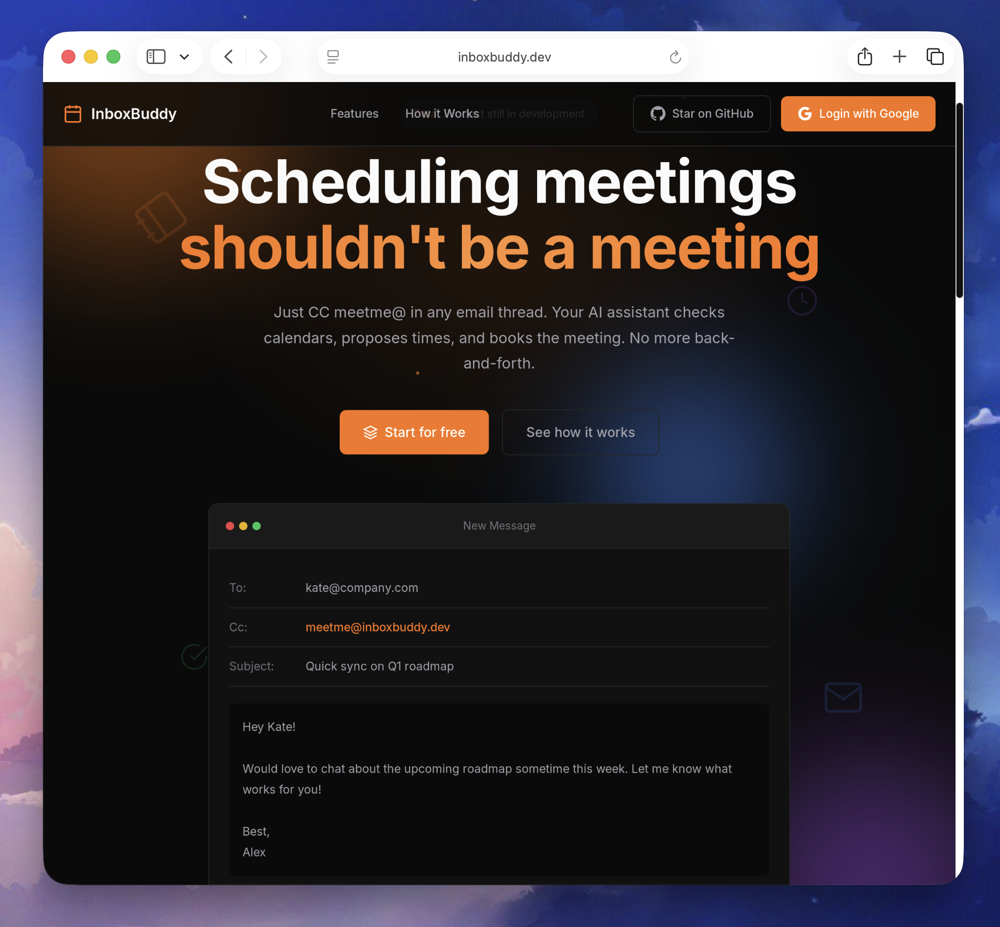
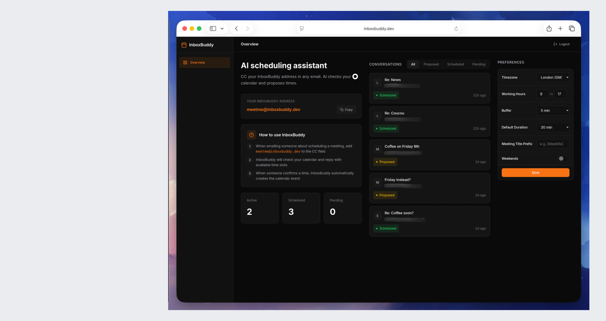
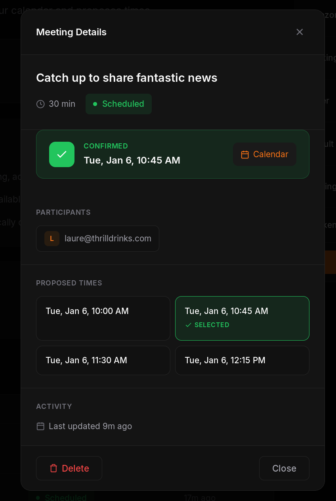

<div align="center">

# InboxBuddy

### AI-Powered Scheduling Assistant

**Just CC meetme@inboxbuddy.dev — your AI schedules the meeting.**

[](https://workers.cloudflare.com/)
[](https://anthropic.com)
[](https://www.typescriptlang.org/)
[](LICENSE)

[Features](#-features) • [Quick Start](#-quick-start) • [How It Works](#-how-it-works) • [Architecture](#-architecture) • [Setup](#-setup-instructions)

</div>

---

## Screenshots

<div align="center">

### Landing Page


### Dashboard


### Confirmation Screen


</div>

---

## Overview

InboxBuddy is a personal AI scheduling assistant built on Cloudflare's Agents SDK. It eliminates the endless back-and-forth of meeting coordination by integrating directly into your existing email workflow.

No new apps. No calendar links. Just CC the bot and let AI handle the rest.

---

## ✨ Features

| Feature | Description |
|---------|-------------|
| 📧 **Email-First Workflow** | Simply CC `meetme@inboxbuddy.dev` in any email thread |
| 🤖 **AI-Powered Understanding** | Uses Claude to parse conversations and extract scheduling intent |
| ⚡ **Smart Time Detection** | Understands "Friday at 10am" and books directly if available |
| 📅 **Calendar Integration** | Checks Google Calendar for availability in real-time |
| 💡 **Smart Proposals** | Suggests time slots that work with your schedule |
| ✅ **Automatic Booking** | Creates calendar events with all attendees once confirmed |
| 🔄 **Real-time Dashboard** | View and manage conversations via WebSocket-powered UI |
| 🗓️ **Reschedule & Cancel** | Handle meeting changes via simple email replies |

---

## 🚀 Quick Start

```bash
# Clone the repository
git clone https://github.com/whoiskatrin/inboxbuddy.git
cd inboxbuddy

# Install dependencies
npm install
cd dashboard && npm install && cd ..

# Configure and deploy (see Setup Instructions below)
npm run deploy
```

---

## 💡 How It Works

```
┌─────────────────────────────────────────────────────────────────┐
│                                                                 │
│  1️⃣  CC meetme@domain.com        2️⃣  AI checks your calendar     │
│     in any email thread             and finds available slots   │
│                                                                 │
│  3️⃣  Reply with preference       4️⃣  Meeting booked!             │
│     "Tuesday works" or               Calendar invites sent      │
│     "Option 2 please"                to all participants        │
│                                                                 │
└─────────────────────────────────────────────────────────────────┘
```

### Example: Smart Booking

If you specify an exact time and it's available, InboxBuddy books it directly:

```
To: colleague@example.com
Cc: meetme@inboxbuddy.dev
Subject: Coffee chat

Hey! Let's grab coffee Wednesday at 10am?
```

> If Wednesday 10am is free, InboxBuddy books it immediately — no confirmation needed.

### Rescheduling & Cancellation

Reply to any scheduled meeting thread:
- **"Can we reschedule?"** → InboxBuddy offers new times
- **"Please cancel"** → InboxBuddy cancels the meeting

---

## 🏗️ Architecture

Built entirely on Cloudflare's edge platform using the **Agents SDK**:

```
┌──────────────────────────────────────────────────────────────────┐
│                        Cloudflare Edge                           │
├──────────────────────────────────────────────────────────────────┤
│                                                                  │
│  ┌─────────────────┐    ┌─────────────────┐    ┌──────────────┐ │
│  │  Email Routing  │───▶│ SchedulingAgent │───▶│  Claude AI   │ │
│  │   (Inbound)     │    │  (Durable Obj)  │    │  (Analysis)  │ │
│  └─────────────────┘    └────────┬────────┘    └──────────────┘ │
│                                  │                               │
│                                  ▼                               │
│  ┌─────────────────┐    ┌─────────────────┐    ┌──────────────┐ │
│  │    Dashboard    │◀──▶│ DashboardAgent  │    │   Google     │ │
│  │  (React + WS)   │    │  (Durable Obj)  │    │  Calendar    │ │
│  └─────────────────┘    └─────────────────┘    └──────────────┘ │
│                                                                  │
│  ┌─────────────────┐    ┌─────────────────┐                     │
│  │   D1 Database   │    │    KV Store     │                     │
│  │ (Conversations) │    │ (OAuth Tokens)  │                     │
│  └─────────────────┘    └─────────────────┘                     │
│                                                                  │
└──────────────────────────────────────────────────────────────────┘
```

| Component | Technology | Purpose |
|-----------|------------|---------|
| **SchedulingAgent** | Agents SDK (Durable Objects) | Email conversations, calendar checks, booking |
| **DashboardAgent** | Agents SDK (Durable Objects) | Real-time WebSocket updates |
| **Email Workers** | Cloudflare Email Routing | Inbound email handling |
| **D1 Database** | Cloudflare D1 | Conversations, users, settings |
| **KV Storage** | Cloudflare KV | Encrypted OAuth token storage |
| **AI** | Claude (Anthropic) | Natural language understanding |
| **Dashboard** | React + Vite | User interface |

---

## 📋 Setup Instructions

<details>
<summary><b>Prerequisites</b></summary>

1. **Cloudflare account** with:
   - Domain configured with Cloudflare DNS
   - Email Routing enabled
   - Workers Paid plan (for Durable Objects)

2. **Google Cloud project** with:
   - Google Calendar API enabled
   - OAuth 2.0 credentials (Web application)

3. **Anthropic API key**

</details>

### Step 1: Clone and Install

```bash
git clone https://github.com/whoiskatrin/inboxbuddy.git
cd inboxbuddy
npm install
cd dashboard && npm install && cd ..
```

### Step 2: Create Cloudflare Resources

```bash
# Login to Cloudflare
npx wrangler login

# Create D1 database
npx wrangler d1 create meetme-db
# Copy the database_id to wrangler.jsonc

# Create KV namespace for tokens
npx wrangler kv namespace create TOKENS
# Copy the id to wrangler.jsonc

# Run database migrations
npx wrangler d1 execute meetme-db --file=./migrations/0001_initial_schema.sql
npx wrangler d1 execute meetme-db --file=./migrations/0002_add_include_weekends.sql
npx wrangler d1 execute meetme-db --file=./migrations/0003_add_meeting_settings.sql
```

### Step 3: Configure Secrets

```bash
npx wrangler secret put ANTHROPIC_API_KEY
npx wrangler secret put GOOGLE_CLIENT_ID
npx wrangler secret put GOOGLE_CLIENT_SECRET
npx wrangler secret put ENCRYPTION_KEY      # Random 32+ char string
npx wrangler secret put SESSION_SECRET      # Random 32+ char string for HMAC signing
```

### Step 4: Configure Email Routing

1. Go to **Cloudflare Dashboard** → **Email** → **Email Routing**
2. Enable Email Routing for your domain
3. Create a custom address: `meetme@yourdomain.com`
4. Route it to: **"Send to Worker"** and select `meetme`

### Step 5: Configure Google OAuth

1. Go to [Google Cloud Console](https://console.cloud.google.com/)
2. Create/select a project
3. Enable **Google Calendar API**
4. Configure OAuth consent screen (add scopes for calendar and profile)
5. Create **OAuth 2.0 credentials** (Web application)
6. Add authorized redirect URI: `https://yourdomain.com/auth/callback`
7. Add authorized JavaScript origin: `https://yourdomain.com`

### Step 6: Build and Deploy

```bash
# Build dashboard
cd dashboard && npm run build && cd ..

# Deploy to Cloudflare
npm run deploy
```

### Step 7: First Login

1. Visit `https://yourdomain.com`
2. Click **"Continue with Google"**
3. Grant calendar permissions
4. Start scheduling!

---

## 📁 Project Structure

```
inboxbuddy/
├── src/
│   ├── index.ts                 # Main worker entry point
│   ├── types/                   # TypeScript definitions
│   ├── agents/
│   │   ├── scheduling-agent.ts  # Email & calendar handling
│   │   ├── dashboard-agent.ts   # Real-time dashboard
│   │   └── conversation.ts      # Deprecated (migration compat)
│   ├── handlers/
│   │   ├── email.ts             # Inbound email processing
│   │   ├── landing.ts           # Landing page
│   │   └── legal.ts             # Privacy & Terms
│   ├── services/
│   │   ├── ai.ts                # Claude integration
│   │   ├── calendar.ts          # Google Calendar API
│   │   └── email.ts             # Outbound email
│   └── utils/
│       └── helpers.ts           # Utilities
├── dashboard/                   # React dashboard (Vite)
├── public/                      # Static assets
├── migrations/                  # D1 database migrations
└── wrangler.jsonc               # Cloudflare config
```

---

## ⚙️ Configuration

### User Settings (via Dashboard)

| Setting | Description |
|---------|-------------|
| **Timezone** | Your local timezone |
| **Working Hours** | Start and end time (24-hour format) |
| **Buffer Time** | Minutes between meetings (0, 5, 10, 15, 30) |
| **Default Duration** | Meeting length (15, 30, 45, 60 min) |
| **Meeting Title Prefix** | Optional prefix for calendar events |
| **Include Weekends** | Toggle weekend availability |

### Environment Variables

| Variable | Description | Default |
|----------|-------------|---------|
| `BOT_EMAIL_PREFIX` | Email prefix | `meetme` |
| `DEFAULT_MEETING_DURATION_MINUTES` | Default meeting length | `30` |
| `WORKING_HOURS_START` | Working day start (24h) | `9` |
| `WORKING_HOURS_END` | Working day end (24h) | `17` |
| `TIMEZONE` | Default timezone | `Europe/Berlin` |

---

## 🔌 API Reference

<details>
<summary><b>Authentication Endpoints</b></summary>

| Endpoint | Method | Description |
|----------|--------|-------------|
| `/auth/config` | GET | Get Google Client ID for OAuth |
| `/auth/google/verify` | POST | Exchange auth code for session |

</details>

<details>
<summary><b>Dashboard API</b></summary>

| Endpoint | Method | Description |
|----------|--------|-------------|
| `/api/me` | GET | Current user info |
| `/agents/dashboard-agent/:email` | WS | WebSocket for real-time updates |

</details>

<details>
<summary><b>Dashboard RPC Methods (WebSocket)</b></summary>

| Method | Description |
|--------|-------------|
| `refresh()` | Refresh conversations list |
| `getConversation(id)` | Get conversation details |
| `deleteConversation(id)` | Delete a conversation |
| `getSettings()` | Get user settings |
| `updateSettings(settings)` | Update settings |

</details>

---

## 🛠️ Local Development

```bash
# Start development server
npm run dev

# In another terminal, start dashboard dev server (optional)
cd dashboard && npm run dev
```

Access at `http://localhost:8787`

---

## 🔒 Security

| Feature | Description |
|---------|-------------|
| **HMAC-signed sessions** | Sessions cannot be forged |
| **Encrypted OAuth tokens** | Stored in KV with AES-GCM encryption |
| **CORS restricted** | Only same-origin requests allowed |
| **SameSite cookies** | Protection against CSRF |
| **No email storage** | Content processed in-memory only |

---

## 🐛 Troubleshooting

<details>
<summary><b>Email not received</b></summary>

- Verify Email Routing is enabled in Cloudflare Dashboard
- Check the email address is routed to the Worker
- View logs: `npx wrangler tail`

</details>

<details>
<summary><b>OAuth errors</b></summary>

- Verify redirect URI matches exactly in Google Cloud Console
- Ensure JavaScript origin is added
- Check secrets are set: `npx wrangler secret list`

</details>

<details>
<summary><b>Wrong timezone in emails</b></summary>

- Update timezone in Dashboard settings
- Default falls back to `TIMEZONE` env variable

</details>

---

## 📄 License

MIT License - see [LICENSE](LICENSE) for details.

---

<div align="center">

**Built with Cloudflare Workers + Agents SDK**

[Report Bug](https://github.com/whoiskatrin/inboxbuddy/issues) • [Request Feature](https://github.com/whoiskatrin/inboxbuddy/issues)

</div>
